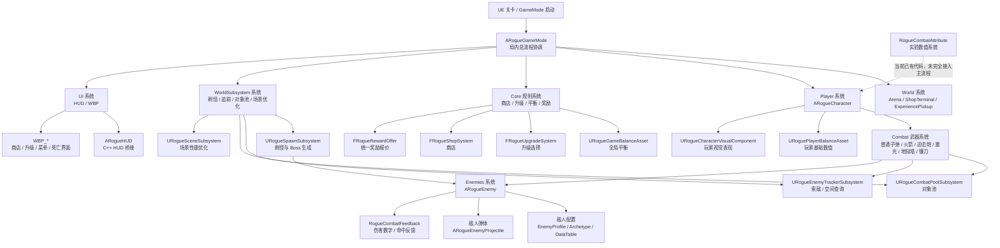
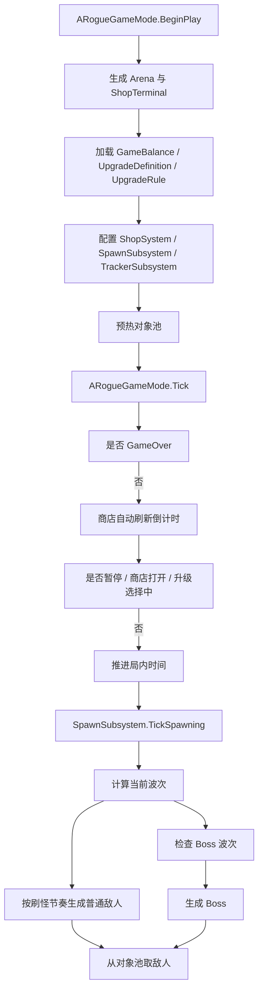
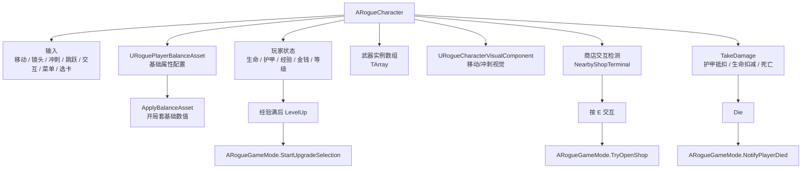
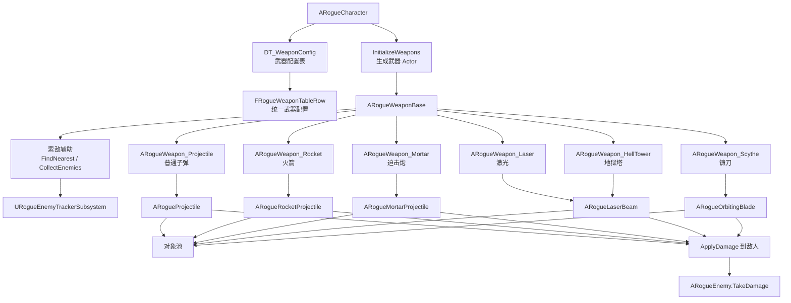
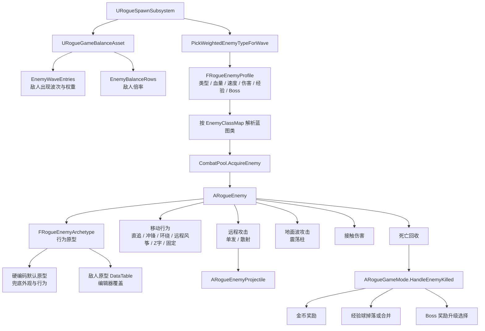
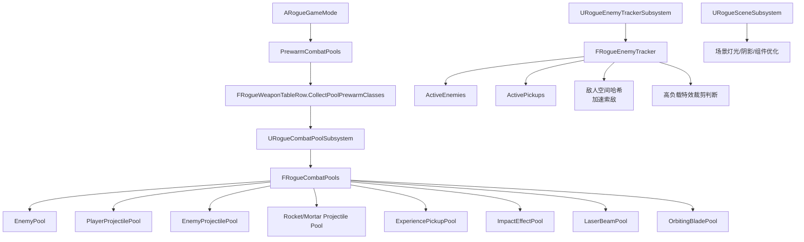
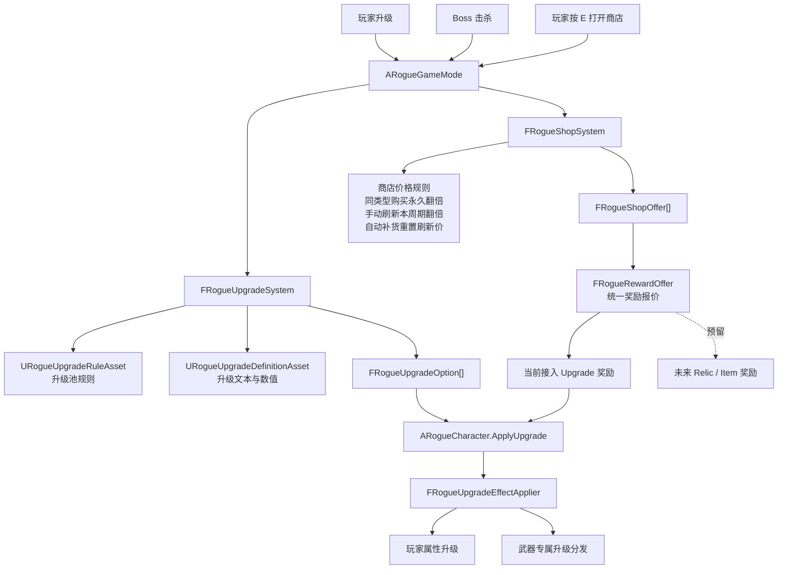
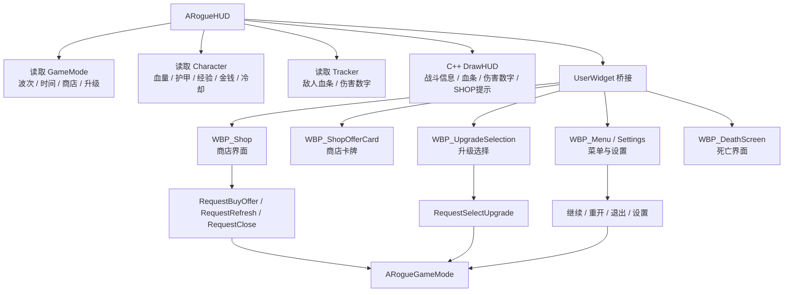
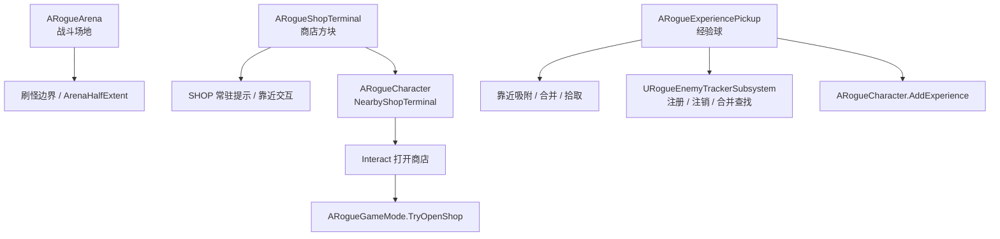
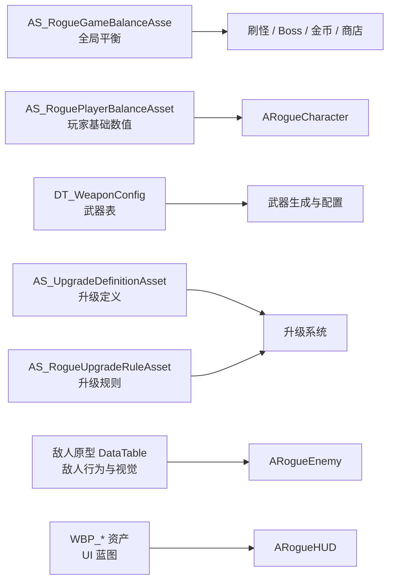

# 当前全系统架构图

这份文档画的是项目当前已经存在的全部主要系统。重点不是“每个类都列出来”，而是把系统边界、数据流、谁调用谁、后续扩展入口画清楚。

## 1. 总览图

## 2. 主循环与运行时流程

## 3. 玩家系统

## 4. 武器与战斗系统

## 5. 敌人与刷怪系统

## 6. 对象池与性能系统

## 7. 升级、商店与奖励系统

## 8. UI 系统

## 9. 世界交互系统

## 10. 数据资产与配置入口

## 11. 当前已有但需要注意的边界

- `ARogueGameMode` 现在主要负责总流程协调，但它仍然是运行时入口，所有“开局初始化、暂停状态、Boss奖励、商店打开关闭”都从这里过。
- `FRogueRewardOffer` 已经作为统一奖励报价结构接入商店，但目前真正落地的奖励类型仍是升级卡，未来道具/遗物可以接在这里。
- `RogueCombatAttribute` 数值系统代码已经存在，但当前还没有完全替换主流程中的玩家属性、武器属性和升级效果。
- `RogueWeaponConfig.h` 是旧武器配置结构，当前主流程已转向 `DT_WeaponConfig + FRogueWeaponTableRow`，旧头文件建议先保留作为资产兼容缓冲。
- UI 当前是混合结构：战斗信息仍由 C++ HUD 绘制，商店/升级/菜单/死亡界面走 WBP。
