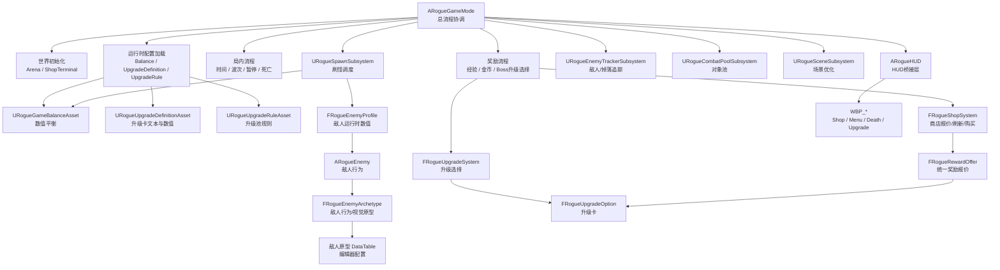
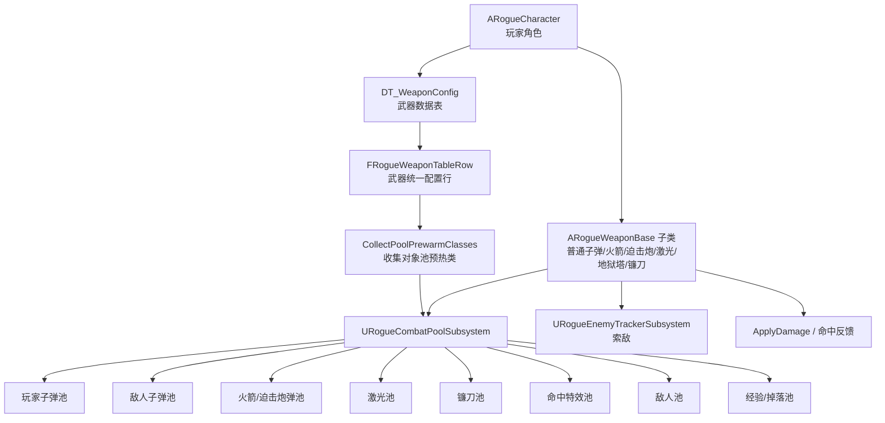
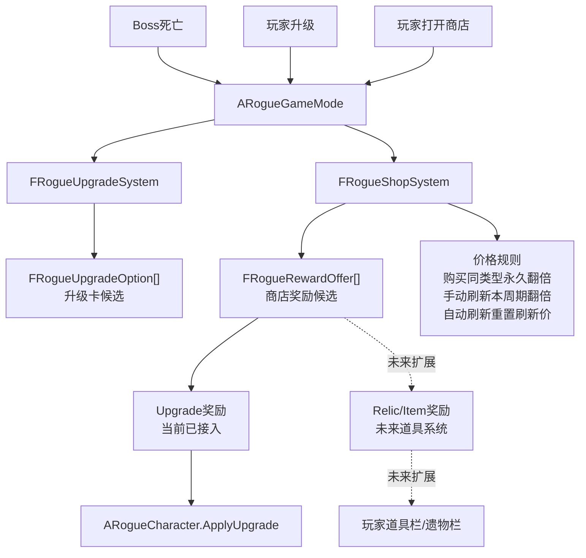
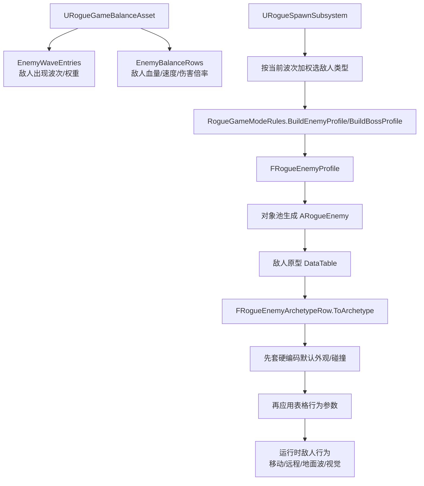
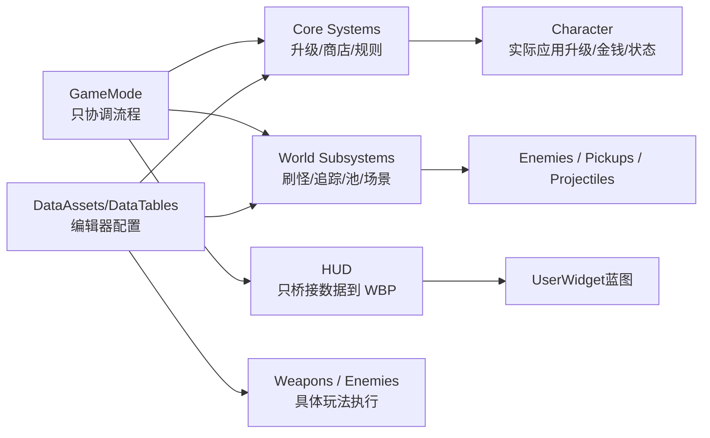

# 优化后的系统结构图

这份图按当前重构后的职责划分来画，重点是看清楚：`GameMode` 只做总流程协调，具体能力下放到系统、子系统、数据资产和 UI Widget。

## 总体结构

## 战斗与武器结构

## 商店、升级、未来道具扩展

## 敌人配置结构

## 当前职责边界

## 后续扩展入口

- 加武器：优先扩展 `FRogueWeaponTableRow` 和对应 `ARogueWeaponBase` 子类，预热类通过 `CollectPoolPrewarmClasses` 收集。
- 加敌人：优先改 `ERogueEnemyType`、敌人平衡资产、敌人原型 DataTable，必要时补 `FRogueEnemyArchetypeRow::ToArchetype`。
- 加升级卡：优先走 `URogueUpgradeDefinitionAsset` 和 `URogueUpgradeRuleAsset`，逻辑落到角色或武器的升级处理函数。
- 加道具/遗物：复用 `FRogueRewardOffer`，新增 `Relic` 类型奖励，再做玩家道具栏和道具效果应用器。
