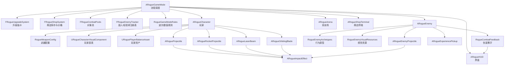
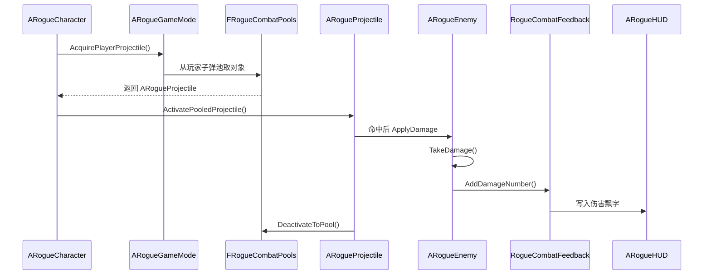
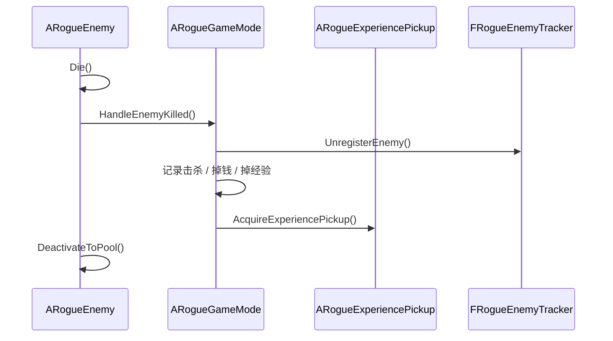
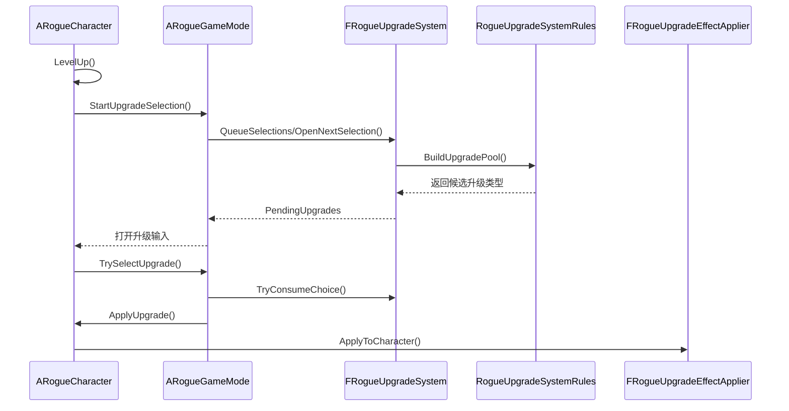

# 游戏系统总览

## 1. 总体定位

这是一个基于 Unreal Engine 5.5 的俯视角肉鸽动作生存项目。当前工程已经形成了相对明确的分层结构：

- **Core**：规则、流程调度、对象池、升级、商店、注册表
- **Player**：玩家角色、武器调度、玩家表现
- **Enemies**：敌人运行时、敌人原型、敌人视觉资源、敌方弹体
- **Combat**：子弹、火箭、激光、镰刀、命中特效
- **World**：竞技场、经验球、商店终端
- **UI**：HUD、升级卡、商店、暂停和结算

可以把这个项目理解成：

- `GameMode` 决定“一局怎么玩”
- `Character` 决定“玩家怎么战斗”
- `Enemy` 决定“敌人怎么行动和受伤”
- `HUD` 决定“玩家看到什么、点什么”
- 其余模块负责把这些主系统拆细

---

## 2. 顶层模块关系

---

## 3. 一局游戏的主循环

### 3.1 开局阶段

`ARogueGameMode::BeginPlay()` 会做这些事情：

1. 生成竞技场 `ARogueArena`
2. 生成商店终端 `ARogueShopTerminal`
3. 优化场景环境
4. 缓存玩家角色
5. 加载平衡资产、升级定义资产、升级规则资产
6. 配置商店系统
7. 预热对象池

这意味着“开局准备”已经是流程层职责，不建议把这些初始化细节再散回别的类里。

---

### 3.2 运行阶段

运行时主要是两条循环并行：

#### 循环 A：波次与刷怪

`ARogueGameMode::Tick()`

负责：

- 运行时间推进
- 波次推进
- 刷怪节奏计算
- 普通怪生成
- Boss 生成
- 商店自动补货计时
- 敌人注册表维护

#### 循环 B：玩家战斗

`ARogueCharacter::Tick()`

负责：

- 移动与镜头
- 冲刺
- 护甲回复
- 自动攻击
- 火箭
- 激光
- 地狱塔
- 镰刀同步
- 外观表现更新

项目真正的战斗压力主要就来自这两个循环。

---

### 3.3 结算阶段

敌人死亡后：

1. `ARogueEnemy::Die()`
2. 通知 `ARogueGameMode::HandleEnemyKilled()`
3. `GameMode` 负责：
   - 增加击杀数
   - 掉经验
   - 掉金币
   - Boss 额外奖励

玩家升级后：

1. `ARogueCharacter::AddExperience()`
2. 触发 `LevelUp()`
3. `GameMode` 打开升级选择

玩家死亡后：

1. `ARogueCharacter::Die()`
2. `GameMode::NotifyPlayerDied()`
3. HUD 打开结算页

---

## 4. Core 层说明

Core 层是当前工程最重要的“组织层”，它决定了项目后面是否容易继续维护。

---

### 4.1 `ARogueGameMode`

文件：

- `Source/ai/Public/Core/RogueGameMode.h`
- `Source/ai/Private/Core/RogueGameMode.cpp`

职责：

- 一局游戏的流程调度器
- 刷怪和 Boss 入口
- 升级流程和商店流程协调
- 世界级服务对外入口

它当前持有：

- `FRogueUpgradeSystem`
- `FRogueShopSystem`
- `FRogueCombatPools`
- `FRogueEnemyTracker`
- `FRogueRunState`

也就是说，它像一个“导演层服务集线器”，但具体规则和服务实现已经尽量拆出去了。

**为什么这是合理的：**

- `GameMode` 本来就适合做局内流程总控
- 但它不应该再亲自维护所有规则细节
- 所以当前项目把“规则”和“服务”从 `GameMode` 抽掉了，只保留调度

---

### 4.2 `RogueGameModeRules`

文件：

- `Source/ai/Public/Core/RogueGameModeRules.h`
- `Source/ai/Private/Core/RogueGameModeRules.cpp`

职责：

- 敌人波次权重
- 刷怪节奏
- 普通敌人数值构建
- Boss 数值构建
- 掉钱规则
- 商店基础数值

这层可以看成“平衡规则层”。

它的优点是：

- `GameMode` 不需要堆一大串 `if`/`switch`
- 以后调平衡可以优先动资产或规则层，而不是动流程层

---

### 4.3 `URogueGameBalanceAsset`

文件：

- `Source/ai/Public/Core/RogueGameBalanceAsset.h`

职责：

- 覆盖 `RogueGameModeRules` 的默认参数

它负责的内容包括：

- 敌人波次权重
- 敌人倍率
- Boss 倍率
- 刷怪参数
- 经验与金币掉落
- 商店基础价格

这是一个非常适合策划/数值调整的资产。

---

### 4.4 `FRogueUpgradeSystem`

文件：

- `Source/ai/Public/Core/RogueUpgradeSystem.h`
- `Source/ai/Private/Core/RogueUpgradeSystem.cpp`

职责：

- 维护当前待选升级
- 维护排队升级次数
- 构建随机升级项
- 消耗玩家选择

它不负责：

- 升级效果落地
- 玩家属性修改

这两者已经被解耦出去。

---

### 4.5 `RogueUpgradeSystemRules`

文件：

- `Source/ai/Public/Core/RogueUpgradeSystemRules.h`
- `Source/ai/Private/Core/RogueUpgradeSystemRules.cpp`

职责：

- 构建升级池
- 定义升级标题、描述、默认数值

这一层是“升级规则层”，相当于升级系统的内容定义和默认规则。

如果你不想去碰流程层，只是要加卡、改卡、调卡，优先找这里。

---

### 4.6 `URogueUpgradeDefinitionAsset`

职责：

- 覆盖升级文案和 Magnitude

### 4.7 `URogueUpgradeRuleAsset`

职责：

- 覆盖升级池规则
- 基础升级池
- 默认武器升级池
- 武器专属规则
- 冲刺最低冷却

所以升级这块已经形成了：

1. **代码默认规则**
2. **资产覆盖入口**
3. **运行时抽卡系统**
4. **独立效果应用器**

这个边界非常适合继续扩展。

---

### 4.8 `FRogueUpgradeEffectApplier`

文件：

- `Source/ai/Public/Core/RogueUpgradeEffectApplier.h`
- `Source/ai/Private/Core/RogueUpgradeEffectApplier.cpp`

职责：

- 把 `FRogueUpgradeOption` 真正应用到玩家角色

这层的意义很大：

- 避免 `ARogueCharacter` 自己维护大段升级 `switch`
- 升级系统不需要知道玩家内部字段
- 新增技能卡时有一个固定落点

---

### 4.9 `FRogueShopSystem`

文件：

- `Source/ai/Public/Core/RogueShopSystem.h`
- `Source/ai/Private/Core/RogueShopSystem.cpp`

职责：

- 商店库存
- 自动补货
- 手动刷新
- 购买逻辑
- 价格演进

当前价格机制：

1. 卡牌价格按升级类型永久翻倍
2. 刷新价格按当前补货周期递增，下周期重置

它本质上是一个纯运行时服务，不建议把它做成纯资产类。

---

### 4.10 `FRogueCombatPools`

文件：

- `Source/ai/Public/Core/RogueCombatPools.h`
- `Source/ai/Private/Core/RogueCombatPools.cpp`

职责：

- 统一管理对象池

当前已经池化：

- 敌人
- 玩家子弹
- 敌人子弹
- 火箭
- 经验球
- 命中特效
- 激光 Beam
- 镰刀

它的存在是为了降低：

- `SpawnActor/Destroy` 开销
- 内存抖动
- 中后期峰值卡顿

---

### 4.11 `FRogueEnemyTracker`

文件：

- `Source/ai/Public/Core/RogueEnemyTracker.h`
- `Source/ai/Private/Core/RogueEnemyTracker.cpp`

职责：

- 敌人注册表
- 经验球注册表
- 空间哈希
- 近邻查询
- 注册表清理

这是后期性能优化的核心模块之一。

很多地方都依赖它：

- 玩家索敌
- 火箭爆炸范围判定
- 激光折射找最近目标
- 地狱塔选目标
- HUD 血条筛选

---

### 4.12 `RogueCombatFeedback`

职责：

- 伤害数字写入 HUD

这层存在的目的是解耦：

- 敌人受伤
- UI 飘字

敌人现在不再直接去找 HUD，而是走这个服务。

---

## 5. Player 层说明

---

### 5.1 `ARogueCharacter`

文件：

- `Source/ai/Public/Player/RogueCharacter.h`
- `Source/ai/Private/Player/RogueCharacter.cpp`

职责：

- 玩家移动
- 镜头控制
- 冲刺
- 护甲回复
- 金币和经验
- 武器调度
- 升级应用入口
- 商店交互入口

它是玩家侧最核心的运行类。

当前武器运行方式是：

- 普通子弹：定时找目标发射
- 镰刀：常驻环绕，数量同步
- 火箭：定时齐射
- 激光：瞬发 Beam
- 地狱塔：持续锁定伤害

`Character` 的定位是“武器调度器”，不是“所有武器行为都在这里写完”。真正的飞行、命中和表现由 Combat 层对象承担。

---

### 5.2 `RogueWeaponConfig`

文件：

- `Source/ai/Public/Player/RogueWeaponConfig.h`

职责：

- 定义玩家各武器族的基础参数结构

为什么重要：

- 新武器扩展时有明确入口
- 不会再把数值散落在 `Character.cpp`

这里要特别注意一条边界：

- `RogueWeaponConfig` 负责**玩法参数**
- 不负责具体战斗对象自己的**表现参数**

也就是说，像下面这些应该继续放在武器配置层：

- 伤害
- 冷却
- 射程
- 数量
- 爆炸半径
- 折射次数

而像下面这些，则更适合放在各个表现类自己的头文件里：

- Beam 粗细
- Glow 尺寸
- Ring 尺寸
- Light 强度
- 拖尾长度
- 脉冲幅度

这样 `Character` 管“玩法”，`Combat Actor` 管“表现”，职责不会互相污染。

---

### 5.3 `URoguePlayerBalanceAsset`

文件：

- `Source/ai/Public/Player/RoguePlayerBalanceAsset.h`

职责：

- 覆盖玩家基础属性
- 覆盖武器基础参数

这层适合调：

- 开局生命
- 护甲
- 移速
- 冲刺
- 各武器默认冷却、伤害、数量

---

### 5.4 `URogueCharacterVisualComponent`

职责：

- 玩家模型和发光表现
- 玩家随状态变化的视觉更新

它的存在是为了避免：

- `ARogueCharacter` 同时管理一堆 Mesh/材质/脉冲动画

这意味着以后你要美化玩家角色，优先改这个组件，而不是继续把视觉代码塞回角色类。

---

## 6. Enemies 层说明

---

### 6.1 `ARogueEnemy`

职责：

- 敌人运行时实体
- 移动
- 接触伤害
- 远程攻击
- 受伤
- 死亡
- 池化激活/回收

这里的设计重点是：

- **所有敌人共用一个运行时类**
- 行为差异由原型决定

这样加敌人时更快，也更利于维护。

---

### 6.2 `RogueEnemyArchetypes`

职责：

- 给每种敌人构造行为原型

原型由三部分组成：

1. `Movement`
2. `Ranged`
3. `Visual`

这层负责回答：

- 这个敌人怎么动
- 这个敌人会不会远程
- 这个敌人长什么样

---

### 6.3 `RogueEnemyVisualResources`

职责：

- 加载默认 Mesh / Material 资源
- 根据 `VisualKey` 返回一套视觉选择

这层把资源路径集中起来了，避免敌人类里塞一大堆 `ConstructorHelpers`。

---

### 6.4 `ARogueEnemyProjectile`

职责：

- 敌方远程弹体
- 飞行
- 命中玩家
- 对象池回收

它和玩家普通子弹属于同类对象，只是所有者和伤害目标不同。

---

## 7. Combat 层说明

Combat 层是玩家和敌人的“短命战斗对象层”。

---

### 7.1 `ARogueProjectile`

玩家普通子弹：

- 发射
- 飞行
- 命中敌人
- 回池

---

### 7.2 `ARogueRocketProjectile`

玩家火箭：

- 发射
- 飞行
- 爆炸
- 范围伤害
- 回池

---

### 7.3 `ARogueLaserBeam`

激光视觉对象：

- 显示 Beam
- 生命周期短
- 对象池复用

真正的伤害主逻辑仍然在玩家侧调度中结算。

---

### 7.4 `ARogueOrbitingBlade`

镰刀对象：

- 环绕表现
- 碰撞伤害
- 对象池复用

玩家侧只维护“需要几把”和“公共环绕角度”。

---

### 7.5 `ARogueImpactEffect`

命中特效对象：

- 命中火花
- 爆炸表现
- 短生命周期
- 对象池复用

它已经做过高压场景限流，怪多时会自动裁特效。

---

### 7.6 Combat 层现在的参数边界

当前 Combat 层已经按统一规则整理过：

- [RogueProjectile.h](/F:/AI_WorkSpeace/ai/Source/ai/Public/Combat/RogueProjectile.h)
- [RogueRocketProjectile.h](/F:/AI_WorkSpeace/ai/Source/ai/Public/Combat/RogueRocketProjectile.h)
- [RogueLaserBeam.h](/F:/AI_WorkSpeace/ai/Source/ai/Public/Combat/RogueLaserBeam.h)
- [RogueOrbitingBlade.h](/F:/AI_WorkSpeace/ai/Source/ai/Public/Combat/RogueOrbitingBlade.h)
- [RogueImpactEffect.h](/F:/AI_WorkSpeace/ai/Source/ai/Public/Combat/RogueImpactEffect.h)
- [RogueEnemyProjectile.h](/F:/AI_WorkSpeace/ai/Source/ai/Public/Enemies/RogueEnemyProjectile.h)

这几类里抽出来的，都是**表现参数**，例如：

- 尺寸
- glow/ring/trail 缩放
- 灯光范围
- 脉冲速度
- 简化模式显示
- 命中特效缩放

而真正影响平衡的玩法参数，仍然留在：

- `RogueWeaponConfig`
- `URoguePlayerBalanceAsset`
- 升级系统
- 规则层

这条边界是现在维护时最重要的约定之一，因为它决定了：

1. 玩法调平衡时不会误改视觉类
2. 视觉换皮时不会误碰伤害逻辑
3. 新武器扩展有统一模板
4. 各类战斗对象的结构会越来越像，后面更好维护

---

## 8. World 层说明

---

### 8.1 `ARogueArena`

职责：

- 代码生成竞技场
- 场地边界
- 场景基础表现

它让项目不再依赖默认小地图。

---

### 8.2 `ARogueExperiencePickup`

职责：

- 经验球实体
- 吸附
- 合并
- 回池

它和 `EnemyTracker` 有直接协作：

- 死怪掉落
- 就近合并
- 超时吸附
- 注册表维护

---

### 8.3 `ARogueShopTerminal`

职责：

- 世界中的商店交互点
- 靠近时让玩家进入可交互状态
- 提供 `SHOP` 提示的世界坐标

它本身不负责商店逻辑，只负责场景里的终端存在。

---

## 9. UI 层说明

### 9.1 `ARogueHUD`

职责：

- 左上角战斗 HUD
- 头顶血条
- 伤害数字
- 升级卡牌
- 商店
- 暂停菜单
- 结算页

为什么仍然保留在 HUD 而不是拆成多个 Widget：

- 这个项目目前以代码驱动为主
- 这样迭代速度快
- 逻辑还比较集中

但也意味着：

- HUD 仍是一个相对大的类
- 后面如果 UI 复杂度继续上升，可以再拆

---

## 10. 资产化边界

当前项目已经明确了哪些东西适合资产化，哪些不适合。

### 10.1 已资产化或可资产化的内容

- 玩家基础数值
- 玩家武器基础数值
- 敌人平衡
- 波次权重
- 商店基础参数
- 升级文案
- 升级池规则

### 10.2 明确不建议资产化的内容

- 对象池实现
- 空间哈希
- 敌人注册表
- 伤害结算
- Tick 流程
- UI 点击命令分发
- 暂停/升级/商店状态流转

边界清楚，后面维护才不会乱。

---

## 11. 典型运行时时序

### 11.1 玩家子弹攻击流程

---

### 11.2 敌人死亡流程

---

### 11.3 升级流程

---

## 12. 当前最重要的维护结论

### 12.1 这个项目现在已经不是“所有代码都挤在一起”的状态

现在最核心的边界已经比较清楚：

- `GameMode` 负责调度
- `Rules` 负责规则
- `Assets` 负责内容数据
- `Character` 负责玩家运行时
- `Enemy` 负责敌人运行时
- `Pools/Tracker` 负责性能层支持

### 12.2 真正的扩展热点只剩几处

未来继续扩内容时，最容易再变胖的地方有：

- `ARogueCharacter`
- `ARogueHUD`
- `ARogueEnemy`

所以后续扩展时最好坚持两个原则：

1. **先看能不能挂到已有边界上**
2. **尽量不要把功能重新卷回核心类**

### 12.3 现在最稳的扩展方式

如果你要长期做这个项目，推荐的思路是：

- 数值和平衡优先进资产
- 新武器沿 `WeaponConfig + PlayerBalanceAsset + UpgradeSystem + CombatActor` 扩
- 新敌人沿 `EnemyType + Archetype + VisualResource + BalanceAsset` 扩
- 高频对象默认进池

这样能保证项目继续长大时，结构还是可控的。
